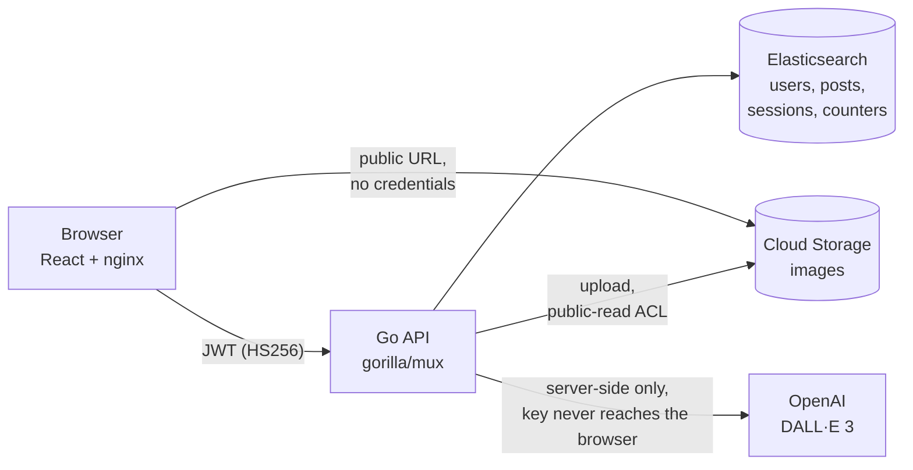

# Neural Canvas

[](https://github.com/luc1ferxx/neural-canvas/actions/workflows/ci.yml)

A social image gallery where posts are generated by DALL·E. Go API, React frontend,
Elasticsearch, Google Cloud Storage.

The interesting part is not the feature list — it is that the whole stack runs
offline with one command, that the paths which cost money or hold credentials are
exercised by tests against real services rather than mocks, and that the trade-offs
are written down where they were made.

Load testing it found a real bug: the Elasticsearch client was using Go's default
two-connections-per-host pool, which no functional test could have caught. Sizing
the pool took p99 on the authenticated read path from 53.8 ms to 1.7 ms and turned
a 10%-success collapse at 6,400 req/s into 100% success — see
[Load testing](#load-testing).

```bash
docker compose up --build     # Elasticsearch + storage emulator + API + frontend
open http://localhost:3000    # no cloud account, no API key, no billing
```

<!-- Screenshots: drop PNGs in docs/ and uncomment.


-->

## Architecture



The browser loads images straight from storage, so image bytes never pass through
the API twice. The DALL·E call is server-side because the key must not ship in a
bundle — an earlier version of this project got that wrong, and the guard against
regressing it is a CI step that greps the built bundle.

## Where to look

If you have five minutes and want the parts worth reviewing:

| File | Why |
|---|---|
| [`backend/main.go`](backend/main.go) | Graceful shutdown that drains in-flight requests on SIGTERM, with the signal-vs-shutdown race spelled out |
| [`backend/service/user.go`](backend/service/user.go) | Signup without a check-then-write race, using `op_type=create` for atomic uniqueness |
| [`backend/service/quota.go`](backend/service/quota.go) | Per-user spend limit that fails **closed**, next to a login throttle that fails **open** — opposite calls, both argued |
| [`backend/store/gcs_integration_test.go`](backend/store/gcs_integration_test.go) | Tests that were mutation-tested; three of them were wrong the first time, and the comments say how |
| [`backend/handler/errors.go`](backend/handler/errors.go) | One JSON error envelope with stable codes and the request id, including for the JWT library's own rejections |
| [`docker-compose.yml`](docker-compose.yml) | The offline stack, and three emulator defaults that are load-bearing in non-obvious ways |
| [`backend/store/elasticsearch.go`](backend/store/elasticsearch.go) | The connection pool, and the measurements that explain why the default was a bug |
| [`backend/handler/metrics.go`](backend/handler/metrics.go) | Why the metrics wrap the router instead of using `router.Use`, and what that fixed |
| [`scripts/loadtest.sh`](scripts/loadtest.sh) | One load test used for both the README's numbers and CI's regression gate |
| [`backend/handler/openapi_test.go`](backend/handler/openapi_test.go) | Tests that hold a hand-written OpenAPI spec to the real router, including that documented auth matches the middleware |
| [`.github/workflows/ci.yml`](.github/workflows/ci.yml) | Unit, lint, integration against real Elasticsearch and a storage emulator, plus a job that boots the compose stack, drives a request end to end and load tests it |

## Project Structure

```
.
├── frontend/          # React frontend (Create React App)
│   ├── src/
│   ├── public/
│   ├── Dockerfile     # build with npm, serve with nginx
│   ├── nginx.conf
│   ├── .env.example
│   └── package.json
│
├── backend/           # Go backend
│   ├── handler/       # HTTP handlers, routing, auth middleware, instrumentation
│   ├── service/       # business logic
│   ├── store/         # Elasticsearch + Google Cloud Storage clients
│   ├── media/         # upload content-type validation
│   ├── config/        # environment-driven configuration
│   ├── logging/       # structured logging, request ids
│   ├── metrics/       # Prometheus instruments, in one file so cardinality is reviewable
│   ├── openapi.yaml   # the API contract; tests hold it to the real router
│   ├── Dockerfile     # static binary, non-root, distroless-ish alpine
│   ├── .env.example
│   └── go.mod
│
├── scripts/
│   └── loadtest.sh    # vegeta load test; same script locally and in CI
├── docker-compose.yml # the whole stack, offline
└── README.md
```

## Running it offline

The whole stack runs with no cloud account, no credentials and no billing:

```bash
docker compose up --build
open http://localhost:3000
```

That starts the same Elasticsearch 7.17.24 the tests and the deployment use — with
security enabled, so the credential path is exercised rather than bypassed — a
Google Cloud Storage emulator, the API, and the frontend behind nginx.

The only thing replaced by a substitute is the DALL-E call, via
`IMAGE_PROVIDER=stub`, which renders a placeholder PNG derived from a hash of the
prompt. That is the one step that costs money per request; everything after it is
the production path unmodified — the same content sniffing, the same storage
write, the same public-read ACL, the same index write. The placeholder is a real
encoded PNG for that reason: the bytes have to survive the same validation as a
real upload.

Nothing is persisted. Both stores are deliberately throwaway *together*: the
storage emulator holds objects in memory, so if Elasticsearch kept its indices the
gallery would come back listing posts whose images no longer exist. `docker compose
down` resets everything.

## Configuration

No credentials live in source. Both halves read configuration from the
environment and ship a `.env.example` listing what is required.

**Backend** — copy `backend/.env.example` to `backend/.env` and fill it in.
The server validates everything at startup and exits with a single explanatory
message if anything is missing, too short, or unsafe:

| Variable | Notes |
|---|---|
| `ES_URL` | Use `https` outside local dev; basic auth over plain http sends the password in cleartext |
| `ES_USERNAME`, `ES_PASSWORD` | Elasticsearch credentials |
| `GCS_BUCKET` | Bucket for uploaded and generated media |
| `JWT_SECRET` | HS256 signing key, minimum 32 chars (`openssl rand -base64 48`) |
| `OPENAI_API_KEY` | Server-side only, never exposed to the browser. Required only when `IMAGE_PROVIDER=openai` |
| `IMAGE_PROVIDER` | Optional. `openai` (default) or `stub`. A named switch, not inferred from a missing key |
| `ALLOWED_ORIGINS` | Comma-separated frontend origins; `*` is rejected |
| `PORT` | Optional; defaults to 8080 |
| `METRICS_PORT` | Optional; defaults to 9090. Prometheus `/metrics` on its own listener, so it is not reachable from the API port. Rejected if equal to `PORT` |
| `LOG_LEVEL` | Optional. `debug`, `info` (default), `warn`, `error`. An unrecognised value is rejected |
| `STORAGE_EMULATOR_HOST` | Optional. Points the storage client at an emulator. When set, the server also creates the bucket at startup |

**Frontend** — copy `frontend/.env.example` to `frontend/.env.local`. Only
non-secret values belong there: Create React App inlines every `REACT_APP_*`
variable into the production bundle, where anyone can read it.

## Backend

Go 1.25+. Elasticsearch for users and posts, Google Cloud Storage for media.

```bash
cd backend
cp .env.example .env      # then edit
set -a && . ./.env && set +a
go run .
```

```bash
go build ./...            # compile
go vet ./...              # static checks
golangci-lint run ./...   # linters; config in .golangci.yml
go test ./...             # unit tests
```

`go vet` is the floor. The linter set in `.golangci.yml` caught three sentinel
errors compared with `==` rather than `errors.Is`. One of them, in the GCS delete
path, turned out to be a live bug rather than a latent one: the client returns
`ErrObjectNotExist` wrapped, so the comparison was never true and deleting a post
whose image had already gone failed every time. It also caught a server started
without a header-read timeout. Install it with:

```bash
go install github.com/golangci/golangci-lint/v2/cmd/golangci-lint@v2.12.2
```

Integration tests run against real services and skip unless the corresponding
variable is set. They cover what compiling cannot: that the mappings are accepted,
that the throttle script increments rather than overwrites, that an unindexed
field genuinely cannot be filtered on, that the reindex preserves fields, and that
an object written to storage comes back with the bytes, the content type and the
public-read ACL it was given.

```bash
# Against the compose stack, which already runs both:
docker compose up -d elasticsearch fake-gcs

cd backend
ES_TEST_URL=http://127.0.0.1:9200 \
ES_TEST_USERNAME=elastic ES_TEST_PASSWORD=local-dev-password \
GCS_TEST_EMULATOR=localhost:4443 \
  go test -run Integration -v ./...
```

Credentials are overridable because a cluster that actually checks them is the
only way to exercise that half of the config; with `xpack.security` off, any
username and password work.

CI runs the same suite against both service containers, and a separate job builds
the compose stack and drives a request through it end to end — signup, signin,
generate, fetch the image URL anonymously, delete, then confirm the object is gone.
That job exists because a compose file cannot be verified by reading it: a wrong
image tag, a healthcheck calling a binary the image does not ship, or an emulator
default that turns out to be load-bearing all look exactly like a working file.

### Endpoints

The full contract is [`backend/openapi.yaml`](backend/openapi.yaml) — OpenAPI 3,
every endpoint, every error code, the auth scheme and the request/response
schemas. Paste it into [editor.swagger.io](https://editor.swagger.io/) to browse
it, or generate a client from it.

It is hand-written, which is the choice worth defending. Generating it from
annotations would keep it mechanically in step with the code, but a description
that cannot disagree with the implementation also cannot record an intent — that
`/signin` returns the same message for a bad username as for a bad password *on
purpose*, for instance.

The risk with a hand-written spec is that it rots, and a spec nobody trusts is
worse than none. So five tests in
[`backend/handler/openapi_test.go`](backend/handler/openapi_test.go) hold it to
the code, running in the normal `go test ./...` with no extra tooling:

- the document validates against the OpenAPI 3 meta-schema;
- every route the router serves is described — it walks the real route table, so a
  new endpoint cannot ship undocumented;
- every documented path resolves to a real route, method included;
- **every operation's `security` matches what the middleware does** — an endpoint
  documented as public that answers 401, or one documented as protected that does
  not, fails the build. Getting that backwards in a spec is worse than omitting
  it;
- the documented error-code enum matches the constants the handlers can emit, and
  a real error response is validated against the documented envelope schema.

All five were mutation-tested. One of them passed a mutation it should have
caught: `mux.Router.Match` returns `true` for a path that matches nothing when a
`NotFoundHandler` is set — it found *a handler*, just not a route — so the test
accepted an endpoint the spec had invented. It now checks `match.Route`, which is
the honest signal.

| Method | Path | Auth | Purpose |
|---|---|---|---|
| `GET` | `/healthz` | — | Liveness. Is this process running |
| `GET` | `/readyz` | — | Readiness. Can this process serve traffic |
| `POST` | `/signup` | — | Create an account |
| `POST` | `/signin` | — | Exchange credentials for a 24h JWT |
| `POST` | `/signout` | JWT | Revoke every token issued to the caller so far |
| `POST` | `/generate` | JWT | Generate an image from a prompt, store it, return the post |
| `POST` | `/upload` | JWT | Upload media and create a post |
| `GET` | `/search` | JWT | Search posts by `user` or `keywords`, filter by `type` |
| `DELETE` | `/post/{id}` | JWT | Delete one of your own posts and its stored media |

`GET /search` accepts `from` and `size` for paging, defaulting to `from=0` and
`size=50` with a ceiling of 200. Invalid values are clamped rather than
rejected. It also accepts `type=image` or `type=video`; an unrecognised value is
ignored. Filtering happens in Elasticsearch, so each gallery tab is its own
request rather than a client-side slice of one page.

`DELETE /post/{id}` only removes a post whose `user` matches the caller, and
returns 404 when nothing matches — a missing post and someone else's post are
indistinguishable, so the API does not confirm that another user's post id
exists. The media object is deleted before the index entry, because bucket
objects are world-readable and a leftover file would stay fetchable by URL.

### Errors

Every failure has the same shape:

```json
{
  "error": {
    "code": "rate_limited",
    "message": "Too many failed sign-in attempts, try again later",
    "request_id": "9f2c41a8bd3e5107"
  }
}
```

`code` is stable and meant to be branched on. `message` is prose and may be
reworded at any time, so matching on it is a bug waiting to happen. This replaced
35 `text/plain` responses — a JSON client could not parse them, and status codes
alone cannot separate "username taken" from "password too short", both 400.

Internal detail never reaches the client. A wrapped Elasticsearch error or an
OpenAI quota message goes to the log with the request id attached; the client gets
a generic message and the same id.

### Observability

Logs are JSON on stdout via `log/slog`, using the field names Cloud Logging reads
(`severity`, `message`, `timestamp`) rather than slog's defaults — with the
defaults, every entry arrives at severity "default" and filtering by severity in
the log viewer returns nothing.

Each request gets an id, taken from an inbound `X-Request-Id` when there is one so
it survives the hop from a load balancer, and generated otherwise. It is attached
to every log line the request produces, echoed in the response header, and
included in error bodies. That is what makes a user's report actionable: the id
they can see is the id in the log.

An inbound id is accepted only if it is alphanumeric with dashes and underscores,
at most 64 characters. An id containing a newline could forge log entries in a
line-oriented log, and an unbounded one could flood every line the request emits.

Access log level tracks the outcome: 5xx at error, 4xx at warn, the rest at info,
so a spike of 401s from a stale frontend does not look like an outage. Probes are
not logged; they run every few seconds forever.

`LOG_LEVEL=debug` adds per-request detail — rejected tokens, unparseable bodies,
stored objects. Useful locally, too noisy and too revealing for production.

#### Metrics

Prometheus metrics on `/metrics`, served on **its own listener** (`METRICS_PORT`,
default 9090). Not a route on the API: `/metrics` publishes route names, traffic
volume, error rates, Go runtime internals and the process command line, so it
belongs on a port the scraper can reach and the public cannot. Putting it behind
the API's JWT instead would be worse — the scraper would need a user account, and
would stop working when auth broke, which is exactly when metrics matter.

| Metric | Type | Labels |
|---|---|---|
| `http_requests_total` | counter | `method`, `route`, `status` |
| `http_request_duration_seconds` | histogram | `method`, `route` |
| `http_requests_in_flight` | gauge | — |
| `image_generations_total` | counter | `provider`, `result` |
| `generation_quota_rejections_total` | counter | — |
| `elasticsearch_operation_duration_seconds` | histogram | `operation` |

Four decisions in there are worth more than the list:

**`route` is the mux path template, never the raw path.** With the raw path, a
scanner walking `/admin`, `/.env`, `/wp-login.php` allocates a permanent time
series per probe, in this process and in the scraper — an attacker-controlled
memory leak in the monitoring path. Unmatched requests all collapse into
`route="<unmatched>"`, and `/post/{id}` is one series rather than one per post.

**Every request is counted, including the ones that match no route.** The obvious
way to instrument gorilla/mux is `router.Use`, because it populates the route
before middleware runs. But mux middleware only runs after a route matches, so
scanner traffic — the traffic most worth watching — was recorded by neither the
histogram nor the in-flight gauge, and a 404 flood looked identical to silence.
The instrumentation is now wrapped around the whole chain and names the route with
`router.Match`, which costs a second match per request and buys a
`http_request_duration_seconds_count` that actually equals `http_requests_total`.

**The buckets go to 60s, not Prometheus' default 10s.** `/generate` routinely takes
10–30 seconds waiting on DALL-E. With the defaults every one of those lands in
`+Inf`, the one bucket a quantile cannot interpolate within — so the p99 of the
most expensive endpoint in the service would be unmeasurable while everything else
looked fine.

**Every series is created at zero on startup.** A labelled Prometheus metric does
not exist until something observes it, so a fresh process serves a `/metrics` with
no `image_generations_total` in it at all — and "nothing has been generated yet"
then reads identically to "the metric was renamed" or "that code path was never
deployed". Both failures are silent.

### Load testing

`scripts/loadtest.sh` drives [vegeta](https://github.com/tsenart/vegeta) at the
stack. One script serves two purposes: locally it produces the numbers below, and
CI runs it against the compose stack at much lower rates as a regression gate.
Two scripts would drift, and the number here would stop describing the thing CI
protects.

```bash
docker compose up -d --build --wait
./scripts/loadtest.sh                 # or: SEARCH_RATE=6000 DURATION=60s ./scripts/loadtest.sh
```

Measured on an **Apple M3, 8 cores, 16 GB**, macOS 14 — Go 1.26.5, Elasticsearch
7.17.24 single node with a 1 GB heap, `IMAGE_PROVIDER=stub`. Load generator,
API, Elasticsearch and the storage emulator all on the same machine over
loopback. 30 seconds per scenario.

| Scenario | What it exercises | Rate | Requests | Success | p50 | p95 | p99 | max |
|---|---|---|---|---|---|---|---|---|
| `GET /healthz` | HTTP stack floor: no auth, no I/O | 3000/s | 90,000 | 100% | 0.1 ms | 0.1 ms | 0.2 ms | 13 ms |
| `GET /search` | JWT check + revocation lookup + query | 3000/s | 90,001 | 100% | 0.3 ms | 0.8 ms | 1.9 ms | 26.5 ms |
| `POST /signin` | bcrypt | 10/s | 300 | 100% | 60.4 ms | 61.8 ms | 63 ms | 69.8 ms |

Read the third row as the design working, not as a problem: bcrypt is *supposed*
to cost 60ms. The reason `/signin` is driven at 10/s and not 3000/s is that it is
CPU-bound by intent, so saturating it would measure the depth of the queue rather
than the hash.

Beyond the table, `/search` sustains **6,400 req/s at p99 13 ms**, saturates
around 8,500/s, and collapses at 12,800/s.

**What load testing actually found.** The interesting result was not a number, it
was a bug that no functional test could have caught. `olivere/elastic` falls back
to `http.DefaultClient`, whose transport keeps **two** idle connections per host.
Two is plenty when requests arrive one at a time, which is why every test passed
and manual use looked fine. Under concurrency the third simultaneous query opens a
fresh TCP connection and, on completion, finds both idle slots taken and closes it
again — and since every authenticated request makes two Elasticsearch calls (the
session-revocation get, then the query), the churn scales with traffic.

Same machine, same 3000/s load for 15 s, the only change being an explicitly sized
pool (`store/elasticsearch.go`):

| | Default transport | Sized pool |
|---|---|---|
| Sockets left in `TIME_WAIT` | 9,529 | **0** |
| Connections held open to ES | 4 | 46 |
| p95 | 9.7 ms | **0.6 ms** |
| p99 | 53.8 ms | **1.7 ms** |
| max | 222.6 ms | **11.1 ms** |
| At 6,400 req/s | 10% success, 3,670 `500`s | **100% success**, p99 13.4 ms |

The 53.8ms p99 against a 0.4ms median is the shape of TCP setup, not of query
work. The `500`s at 6,400/s were `connection reset by peer` from Elasticsearch,
and the connection churn had eaten enough of the machine's ephemeral ports that
the load generator started failing to `bind` as well.

Where the time goes, from the service's own metrics during the run: two
Elasticsearch round trips per authenticated request, ~0.16 ms for the revocation
`get` and ~0.26 ms for the query, out of a ~0.47 ms request. **Roughly 90% of
`/search` is Elasticsearch**, which is why the per-request revocation lookup —
see [Authentication](#authentication) — is the first thing a cache would target if
that lookup ever stopped being cheap.

**What these numbers are not.** The index holds tens of documents, not millions,
so they say nothing about how the query scales with corpus size. Everything is on
one machine over loopback, so no real network is involved and the load generator
competes with the service for CPU. A single Elasticsearch node with one shard and
no replicas is not a cluster. `/generate` is not load tested at all: the quota caps
it at 20 per user per day, so a sustained rate against it would measure the
rejection path, and against the real provider it would spend money.

### Health probes

Two endpoints, because they answer different questions and a single one cannot.

`/healthz` is liveness and checks nothing but itself. If it reported unhealthy
whenever Elasticsearch was unreachable, an orchestrator would respond to an
Elasticsearch outage by killing and restarting every instance — which does not
repair Elasticsearch, and turns a recoverable dependency blip into a restart loop.
Liveness asks "is this process wedged", and only a restart fixes that.

`/readyz` is readiness and pings Elasticsearch, answering 503 when it cannot be
reached. That takes the instance out of the load balancer's rotation without
killing it, so it rejoins by itself once the dependency recovers. 503 rather than
500 because it tells a load balancer to look elsewhere instead of retrying here.

### Lifecycle

The server traps `SIGTERM` and `SIGINT`, stops accepting connections, and gives
in-flight handlers 25 seconds to finish — under App Engine's own grace period, so
it has time to matter. Before this the process was killed outright, and a 32 MiB
upload became a connection reset with no status code to interpret.

Every outbound call takes a context derived from the request, so a client that
hangs up cancels the Elasticsearch query it was waiting on, and each call has its
own deadline (`backend/store/timeouts.go`). The bounds differ by two orders of
magnitude because a keyword lookup and a 32 MiB upload are not the same operation.

One deliberate exception: once `/generate` has called DALL-E, OpenAI has been
billed, so the GCS upload and index write that follow run under
`context.WithoutCancel`. A client hanging up during a 30-second wait is ordinary,
and cancelling there would spend the money and throw the image away.

### Authentication

Passwords are stored as bcrypt hashes; the plaintext is never persisted and
never part of a query. Sign-in looks the user up by document id, which is
realtime in Elasticsearch, so a freshly registered account can log in
immediately. `POST /signin` returns `{"token": "..."}`.

Signing out is enforced server-side. A JWT is self-contained, so clearing it in
the browser alone left it valid for the remainder of its 24 hours. `POST
/signout` records a `tokensValidAfter` timestamp on the user, and any token
issued before it is refused on the next request. The state lives in
Elasticsearch, so a sign-out applies across instances.

Failed sign-ins are throttled per username: 5 attempts per 15 minutes. Counters
live in Elasticsearch and are incremented by a Painless script, so the increment
is atomic and the limit is shared rather than per-instance.

Signups enforce uniqueness with a create-only write (`op_type=create`) rather than
a read followed by a write. Elasticsearch has no unique constraint, so the old
check-then-index left a window: measured against the reverted implementation, up
to 6 of 8 concurrent signups for the same name all "succeeded", and the last write
won — leaving the earlier registrants holding a password that had been replaced by
someone else's.

### Cost control

`/generate` is the only endpoint that spends money: DALL-E bills per image. It is
capped at 20 generations per user per rolling 24 hours, on the same Elasticsearch
counter as the login throttle but in its own index — sharing one would mean a
successful sign-in, which clears login failures, also handed back a fresh spending
allowance.

The count is incremented *before* the call, which is the opposite of the login
throttle. A failure occurring after OpenAI has been reached has still been billed,
so counting only successes would let a caller whose prompt reliably fails
downstream spend without limit. This over-charges by the number of genuine internal
failures, which is the cheaper mistake.

It is check-then-increment, so a simultaneous burst can overshoot by roughly the
concurrency. The increment itself is atomic, so the overshoot is bounded and small.
For a spending cap, "20, occasionally 22" is a different thing from "unbounded".

If the quota store is unreachable the request is refused, not allowed through. That
is also the opposite of the login throttle, which fails open: failing open on a
brute-force limiter still leaves the attacker facing the credential check, whereas
failing open on a spending limit turns an Elasticsearch outage into an unbounded
OpenAI bill.

### Media handling

Uploads are capped at 32 MiB and typed by inspecting their leading bytes, not by
filename extension. Accepted: JPEG, PNG, GIF, WebP, MP4, WebM, AVI, QuickTime,
FLV and WMV. The last three are detected from explicit container signatures,
since Go's `http.DetectContentType` has no entry for them.

Objects in the bucket are world-readable, so script-capable formats are refused
outright: an accepted `.svg` or `.html` would be stored XSS served from the
app's own storage domain.

### Migrating an existing deployment

The post index is versioned. The original mapping declared `type` with
`"index": false`, which makes the field unsearchable — Elasticsearch rejects a
filter on it with a 400 rather than returning nothing — and that parameter
cannot be changed on an existing field. So filtering by type server-side
required a new index.

After deploying, copy the old documents across:

```bash
cd backend
set -a && . ./.env && set +a
go run ./cmd/reindex
```

The values survive the copy because an unindexed field is still stored in
`_source`. The command refuses to write into a non-empty destination unless
given `-force`, and the server prints a prominent warning at startup while the
migration is outstanding, so an empty gallery is not mistaken for data loss.

Delete the legacy index once you are satisfied:

```bash
curl -XDELETE "$ES_URL/post" -u "$ES_USERNAME:$ES_PASSWORD"
```

## Frontend

```bash
cd frontend
npm install
cp .env.example .env.local   # then edit
npm start
```

```bash
npm run build             # production build
npm test                  # tests
```

Image generation calls the backend's `POST /generate`, which invokes DALL-E,
stores the result, and returns the saved post. The frontend holds no API key.

## Features

- User authentication (signup/login) with bcrypt-hashed passwords
- AI image generation via DALL-E, executed server-side
- Image upload and gallery management
- Search by keyword or user
- Responsive design

## Technologies

- **Frontend**: React 18, Material-UI, antd, Axios, React Router
- **Backend**: Go, gorilla/mux, Elasticsearch, Google Cloud Storage
- **Auth**: JWT (HS256), bcrypt
- **API**: RESTful endpoints

## Known gaps

- A revoked session is enforced with one Elasticsearch get per authenticated
  request, measured at ~0.16 ms and about a third of the Elasticsearch time on the
  read path. A short-lived cache would trade immediate revocation for throughput if
  it ever stops being cheap; at the measured cost it has not earned the
  inconsistency yet.
- Overload is not shed gracefully. Past saturation the API returns `500`s from
  failed Elasticsearch calls rather than refusing work early with a `503`. Bounded
  concurrency in front of the datastore, or a circuit breaker, would turn a
  collapse into degradation — the load test above is what makes this visible, and
  the fix is not written yet.
- `/signout` revokes every token for that user, not just the one presented.
  Signing out of one browser signs out of all of them.
- Search paging is offset-based (`from`/`size`), which degrades past roughly
  10,000 results. A `search_after` cursor would be needed beyond that.
- The DALL-E call itself has never been exercised in this repo's tests: it costs
  money per request, so `IMAGE_PROVIDER=stub` covers the pipeline around it and the
  call itself is checked by hand. The storage write, ACL and delete now run against
  an emulator in CI.
- Elasticsearch is the only datastore, including for users. It is not a relational
  database and does not pretend to be one: uniqueness needs `op_type=create`, a
  write is not immediately visible without `refresh=wait_for`, and there are no
  transactions. Those constraints are worked around explicitly rather than
  ignored, but a relational store for accounts would be the right answer at any
  real scale.

## License

[MIT](LICENSE)
